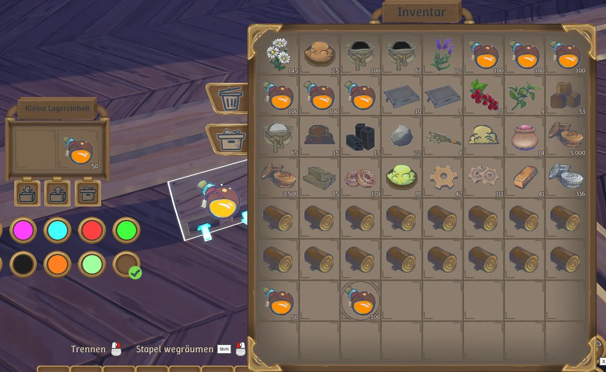
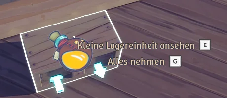

# Inventory Slot Reservations

Experimental UE4SS Lua mod for **Alchemy Factory**. Reserve player-inventory slots for particular item types, then fill **only those slots** from the closed chest you are looking at. The game performs the transfers and applies its native item-specific stack limits. **Current implementation and testing cover single-player only; multiplayer support is a goal, not yet implemented or verified.**

## Use

1. Open your inventory. Hover an **occupied player slot** and press **N** to reserve that item's type. A circle marks the reservation. Press N on the same slot again to clear it. The filter remains attached if the stack is emptied and persists in the save.
2. Close the chest inventory and look directly at a chest until its **E/G interaction prompt** appears. Press **N** to pull matching items into reserved player slots. An empty reserved slot can be filled; a partially filled one receives only what fits. Unreserved slots and unrelated items are not pull destinations.
3. N while the chest inventory is open does **not** pull. The game's **G / Take All** respects the native slot filters. The native sort button is disabled while reservations exist because sorting ignores filters; there is no custom sorting or M binding.

Edit `Scripts/config.lua` to change `toggleKey = "N"`, then restart the game. The same key performs both actions. Reservations work with arbitrary item IDs, not a fixed list of ingredients.



*The marked player slot is reserved. This screenshot shows the **open** chest inventory, where N does not pull.*



*Look at a **closed** chest with this interaction prompt and press N to refill reservations. The screenshots show a German-language game UI; the mod has no language setting.*

## Installation

> Tip: Use AI agent for installation

This is an unofficial code mod, **not** a Steam Workshop blueprint. Back up `%LOCALAPPDATA%\AlchemyFactory\Saved\SaveGames` (Windows) or the corresponding Proton prefix's `drive_c/users/steamuser/AppData/Local/AlchemyFactory/Saved/SaveGames` (Linux) before installing. Test in single-player on a save you can restore. Game or UE4SS updates may break compatibility.

You need a **compatible UE4SS installation that loads Lua mods for this game**. The tested setup used experimental UE4SS commit `44afb36d` via its `dwmapi.dll` proxy; another UE4SS release is not guaranteed to work. Follow [UE4SS installation guidance](https://docs.ue4ss.com/installation-guide.html) for your build. Do not replace an existing loader or its settings without backing them up.

The game directory below is the folder containing `AlchemyFactory.exe` (Steam → game → Manage → Browse local files):

```text
Alchemy Factory/
  AlchemyFactory.exe
  AlchemyFactory/Binaries/Win64/
    AlchemyFactory-Win64-Shipping.exe
    dwmapi.dll                      <- UE4SS proxy, if using this loader method
    ue4ss/
      UE4SS.dll
      Mods/
        mods.txt
        InventorySlotReservations/
          mod.json
          Scripts/
            main.lua
            config.lua
            chestpull.lua
            slot_binding.lua
            reservation_policy.lua
```

1. **Windows:** Install UE4SS in `AlchemyFactory/Binaries/Win64/` according to its instructions. Copy this repository's entire `InventorySlotReservations` folder into `AlchemyFactory/Binaries/Win64/ue4ss/Mods/`; keep the `Scripts` directory intact.
2. **Linux / Steam Proton:** Install UE4SS at the same **Windows game binary path** inside the Steam game directory, not in the Linux Proton binaries. Copy the mod folder to the same `ue4ss/Mods/` location. If using the tested `dwmapi.dll` proxy, add a `dwmapi` **native, builtin** override to this game's Proton prefix (e.g. in `winecfg` → Libraries), or set the game's Steam launch options to `WINEDLLOVERRIDES="dwmapi=n,b" %command%`. Only do this for Alchemy Factory; don't change a global Wine prefix. The local Steam AppID is `3669570`, so the default prefix is `steamapps/compatdata/3669570/pfx/`. If your UE4SS package uses a different proxy, follow its instructions instead.
3. In `ue4ss/Mods/mods.txt`, set/add **`InventorySlotReservations : 1`** (one enabled entry). Restart the game. Check `ue4ss/UE4SS.log` for `Loaded experimental single-player reservations; use key: N` (the current implementation's log message). If another mod registers N, change `Scripts/config.lua` and restart.

To uninstall, disable the entry in `mods.txt` or remove only `Mods/InventorySlotReservations/`, then restart. Remove UE4SS/proxy/Proton override **only if you installed them for this mod and no other mod needs them**. This repository does not bundle UE4SS or game files.

## Scope and safety

The mod calls the native `TryExchangeInventorySlot` with a specific reserved destination, checks both inventories after each asynchronous exchange, and restores a dropped native filter without moving items. It never performs a post-transfer rollback. It stops if another slot changes unexpectedly. The game's UI sort button is disabled, **not** sorting invoked directly by another mod. Multiplayer support still needs implementation (including authority/synchronization) and testing; other chest types, concurrent inventory changes, future game builds, and every item's stack maximum remain unverified. Do not treat this as production-safe.

For test setup, muted isolated-game launch, screenshots, save preparation, test commands and observed results, see [`tests/TESTING.md`](tests/TESTING.md).

## License

The original mod code and documentation in this repository are dedicated under [CC0 1.0 Universal](LICENSE), to the extent we hold the rights to them. No attribution is required. The `LICENSE` file is the unmodified [Creative Commons legal text](https://creativecommons.org/publicdomain/zero/1.0/legalcode.txt).

This dedication does **not** cover Alchemy Factory's game assets visible in `images/`, or third-party software such as UE4SS and the game. Their respective rights remain with their owners.
